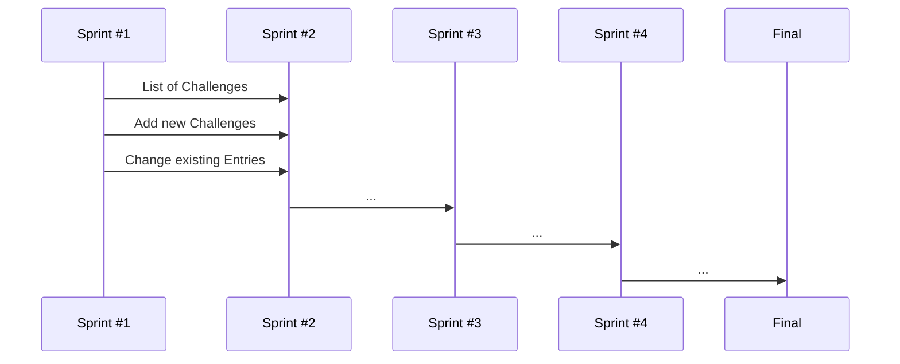

## [WWW.SOCIALLYAWESOME.COM](https://capstone-project-git-list-of-challenges-salaos.vercel.app/challenges) (WORKING TITLE)

---

This is a [Next.js](https://nextjs.org/) project bootstrapped with [`create-next-app`](https://github.com/vercel/next.js/tree/canary/packages/create-next-app).

This project uses [`next/font`](https://nextjs.org/docs/basic-features/font-optimization) to automatically optimize and load Inter, a custom Google Font.

