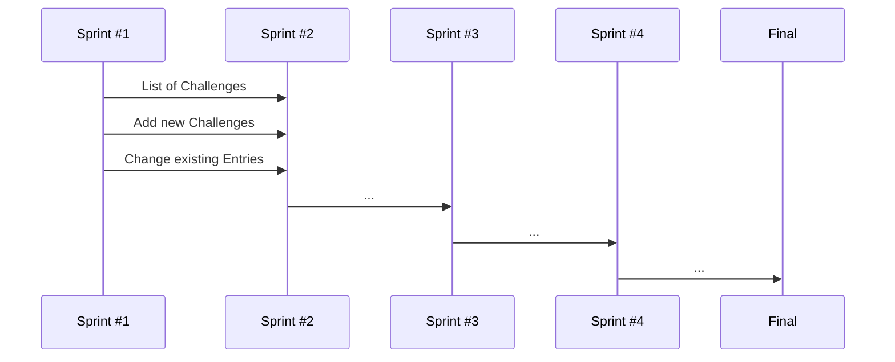

## [WWW.SOCIALLYAWESOME.COM](https://capstone-project-git-list-of-challenges-salaos.vercel.app/challenges) (WORKING TITLE)

## CAPSTONE PROJECT

Overcome social anxiety and build your confidence with our app! Designed for people who struggle with social situations, our app offers a series of challenges to help you face your fears and develop new skills.

Start with simple challenges like making small talk with a stranger or asking for directions, and work your way up to more difficult tasks like giving a presentation or attending a networking event. Each challenge is designed to help you practice social skills and build confidence in a supportive, non-judgmental environment.

Track your progress with our goal-setting and tracking tools, and earn rewards for completing challenges and reaching new levels. With our app, you can build your social skills, conquer your fears, and start living a more confident and fulfilling life.

Key features:

A series of challenges designed to help you practice social skills and build confidence
Goal-setting and tracking tools to monitor your progress
Rewards for completing challenges and reaching new levels
A supportive, non-judgmental environment to help you overcome social anxiety
A fun and engaging way to build your confidence and improve your social skills

## USER STORIES

##PROJECT

__CONCEPT__
 - [ ] Brainstorming
 - [ ] Choose idea
 - [ ] fine conception
 - [ ] set up kanban board

__DESIGN__
 - [ ] Inspiration UI
 - [ ] structure sketch
 - [ ] Wireframes 
 - [ ] Prototype
 - [ ] UX Feedback

__CODE__

_SPRINT #1_
 - [ ] Code User Stories 1-3
 - [ ] Deploy on Vercel
 - [ ] Create project & plan structure & comment
 - [ ] define global CSS
               
_SPRINT #2_
 - [ ] Code User Stories 4-6
             
_SPRINT #3_
 - [ ] Code User Stories 7-9
       
_SPRINT #4_
 - [ ] Code User Stories 9-12
 - [ ] UX Precision work
 - [ ] images, icons, fonts - final linking and filing
 - [ ] Nice-to-Have: Which features next?
 - [ ] CSS Animations & Feedback fine tuning
       
      
__PRESENTATION PREP__
- [ ] Screenvideo / gif
- [ ]  - [ ] Text & Bullets
- [ ] Logo?
- [ ] final readme with project description

## MORE

This is a [Next.js](https://nextjs.org/) project bootstrapped with [`create-next-app`](https://github.com/vercel/next.js/tree/canary/packages/create-next-app). This project uses [`next/font`](https://nextjs.org/docs/basic-features/font-optimization) to automatically optimize and load Inter, a custom Google Font. 

© 2023 Nina Saalfrank. Template neuefische GmbH.

