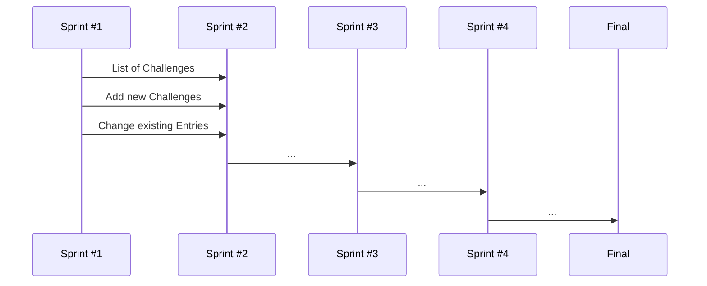

## [WWW.SOCIALLYAWESOME.COM](https://capstone-project-git-list-of-challenges-salaos.vercel.app/challenges) (WORKING TITLE)

## CAPSTONE PROEJCT

## USER STORIES

##PROJECT

__CONCEPT__
 - [ ] Brainstorming
 - [ ] Choose idea
 - [ ] fine conception
 - [ ] set up kanban board

__DESIGN
 - [ ] Inspiration UI
 - [ ] structure sketch
 - [ ] Wireframes 
 - [ ] Prototype
 - [ ] UX Feedback

__CODE

_SPRINT #1
 - [ ] Code User Stories 1-3
 - [ ] Deploy on Vercel
 - [ ] Create project & plan structure & comment
 - [ ] define global CSS
               
_SPRINT #2
 - [ ] Code User Stories 4-6
             
_SPRINT #3
 - [ ] Code User Stories 7-9
       
_SPRINT #4
 - [ ] Code User Stories 9-12
 - [ ] UX Precision work
 - [ ] images, icons, fonts - final linking and filing
 - [ ] Nice-to-Have: Which features next?
 - [ ] CSS Animations & Feedback fine tuning
       
      
__PRESENTATION PREP
- [ ] Screenvideo / gif
- [ ]  - [ ] Text & Bullets
- [ ] Logo?
 - [ ] final readme with project description

## MORE

This is a [Next.js](https://nextjs.org/) project bootstrapped with [`create-next-app`](https://github.com/vercel/next.js/tree/canary/packages/create-next-app). This project uses [`next/font`](https://nextjs.org/docs/basic-features/font-optimization) to automatically optimize and load Inter, a custom Google Font. 

© 2023 Nina Saalfrank

