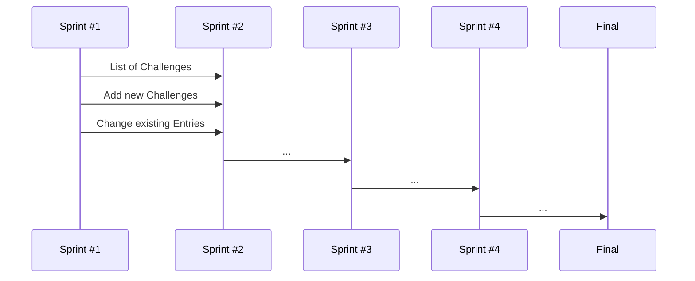

## [WWW.SOCIALLYAWESOME.COM](https://capstone-project-git-list-of-challenges-salaos.vercel.app/challenges) (WORKING TITLE)

    
    

## CAPSTONE PROJECT

The social anxiety Web-Application is designed to help individuals overcome their social anxiety by offering a series of challenges that enable them to face their fears and develop new skills. Users can start with simple challenges and progress to more difficult tasks, all of which are intended to help them practice social skills and build confidence in a supportive, non-judgmental environment. However, it's important to keep in mind that every individual's experience with anxiety is unique, and some may require additional support beyond what the app can provide.

The Application includes creating own challenges and tracking tools that allow users to monitor their progress and earn rewards for completing challenges and reaching new levels. Additionally, the app provides a way for users to improve their social skills and conquer their fears in a fun and engaging manner.

__Key features of the social anxiety app include:__

- A series of challenges designed to help users practice social skills and build confidence
- Every Day a new challenge to get out of the comfort zone
- Tips for managing symptoms of anxiety (grounding techniques, visualization exercises, deep breathing exercises, mindfulness meditation)
- Information for professional help (list of local mental health resources, different types of therapy)
- A supportive, non-judgmental environment to help users overcome social anxiety
- A fun and engaging way to build confidence and improve social skills.

_Nice-to-Have (Maybe someday)_

- Goal-setting and tracking tools to monitor progress on a personal Milestone-Board
- Providing a platform for a pseudonomised community to share experiences
- A reward system that is appropriate for the user's age, like...
           _A leaderboard that allows users to compete with others and track their progress over time
          - Stickers or badges that are earned for completing challenges or reaching certain milestones
          - Animated characters or avatars that can be customized as the child progresses through the app
          - Rewards with real-world value for completing challenges and reaching new levels (coupons or discounts for online stores)
          - Access to premium features within the app (personalized coaching or support from a mental health professional)_

---

## USER STORIES

---

## PROJECT

__CONCEPT__
 - [X] Brainstorming
 - [X] Choose Idea
 - [X] Fine Conception
 - [X] Create Kanban Board

__DESIGN__
 - [X] Inspiration UI
 - [X] Structure Sketch
 - [X] First Wireframes 
 - [ ] Prototype
 - [ ] UX Feedback

__CODE__

_SPRINT #1_
 - [ ] Code User Stories 1-3: My-Challenges
 - [ ] Deployment (Vercel)
 - [ ] Create Project Structure
 - [X] Global CSS
               
_SPRINT #2_
 - [ ] Code User Stories 4-6: Well-Done, Challenge-of-the-Day, Navigation
             
             
_SPRINT #3_
 - [ ] Code User Stories 7-9: Info-Page, MongoDB?
 - [ ] info-page (Stress techniques & exercise, mental health info)
       
_SPRINT #4_
 - [ ] Code User Stories 9-12: Final Fine Tuning & Illus
 - [ ] UX Precision Work
 - [ ] Images, Icons, Fonts, Logo - linking and filing
 - [ ] Illustrations (cute monsters?)
 - [ ] CSS Animations & Feedback
       
      
__PRESENTATION PREP__
- [ ] Screenvideo / gif
- [ ] Description & Bullets
- [ ] Final readme with project description
- [ ] Nice-to-Have (Someday): Which features next? -> User Login & Leaderboard

---

## MORE

This is a [Next.js](https://nextjs.org/) project bootstrapped with [`create-next-app`](https://github.com/vercel/next.js/tree/canary/packages/create-next-app). This project uses [`next/font`](https://nextjs.org/docs/basic-features/font-optimization) to automatically optimize and load Inter, a custom Google Font. 

© 2023 Nina Saalfrank. Template neuefische GmbH.

